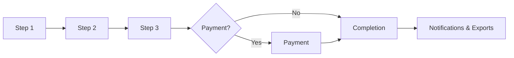
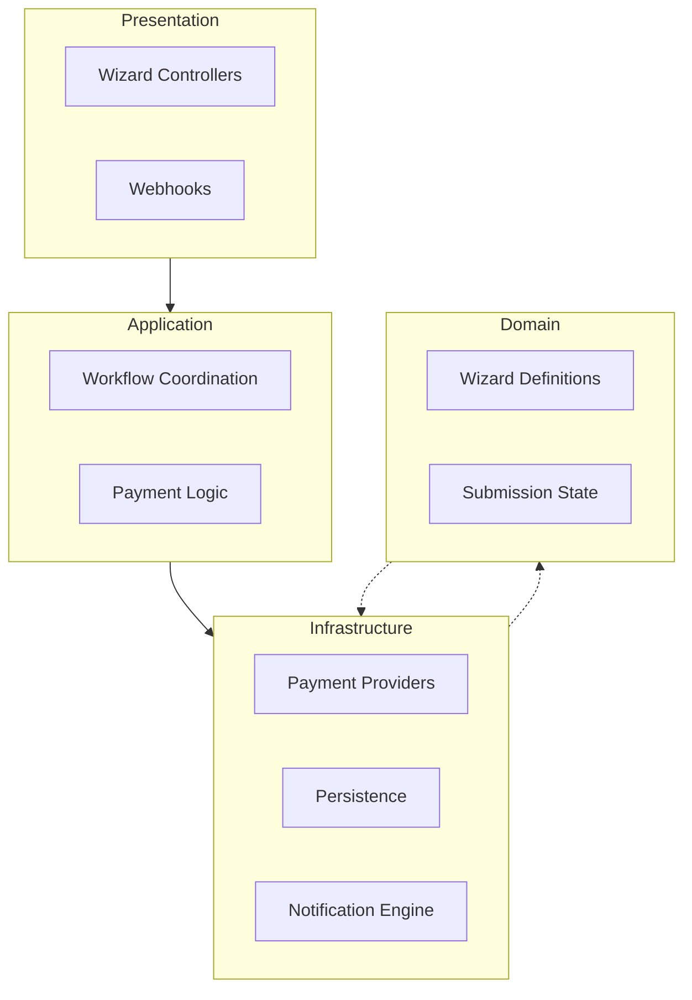

# Mental Model: Yiggle Form Wizard Bundle

The **Yiggle Form Wizard Bundle** is a content-driven multi-step form workflow engine, specifically built for **Sulu 3.x** and powered by **Symfony Form Flow**.

> **The Essence:** Editors configure the wizard structure entirely within the Sulu Admin, while the bundle manages the complex runtime execution and state handling of the form flow.

---

## Core Concepts

| Concept | Definition |
|---------|------------|
| **Wizard** | The form flow definition as configured in the Sulu Admin. |
| **Step** | A specific stage in the wizard that groups related fields. |
| **Field** | An individual input element within a step. |
| **Submission** | A unique instance of a wizard filled out by an end-user. |
| **Payment** | An optional payment associated with a specific submission. |

---

## Example Workflow

The bundle manages the entire lifecycle of a form:

1. **User interaction** — User navigates through the configured steps.
2. **Transactional phase** — If configured, a payment process follows.
3. **Finalization** — The submission status is updated to completed.
4. **Post-processing** — Automatic triggers for notifications and data exports.

---

## Architecture Layers

The bundle follows a **Layered Architecture** to ensure flexibility, maintainability, and testability.

### Presentation Layer
*The interaction layer.*

Handles all HTTP concerns — rendering wizard steps, processing form submissions, and receiving PSP webhooks.

- **Controllers** — Render the wizards and handle webhooks.
- **Forms** — Render Symfony Forms to the frontend.
- **Previews** — Provide receipts and summaries for the end-user.

### Application Layer
*The process orchestrator.*

Coordinates the business workflows without containing domain logic itself.

- Manages submission completion logic.
- Initiates and confirms payments.
- Dispatches domain events (e.g., `WizardSubmissionCompletedEvent`).

### Infrastructure Layer
*The bridge to external systems.*

Implements the technical concerns required by the application and domain layers.

- **Integrations** — Payment providers (e.g., Mollie), custom field handlers.
- **Persistence** — Database storage handled via Doctrine.
- **Output** — Export systems and notification engines.

### Domain Layer
*The core logic without external dependencies.*

Contains the pure business rules of the wizard system. Has no dependency on Symfony, Sulu, or Doctrine.

- Contains Wizard and Step definitions.
- Manages the state of Submissions and Payments.
- **Dependency-free** — No framework-specific code.
