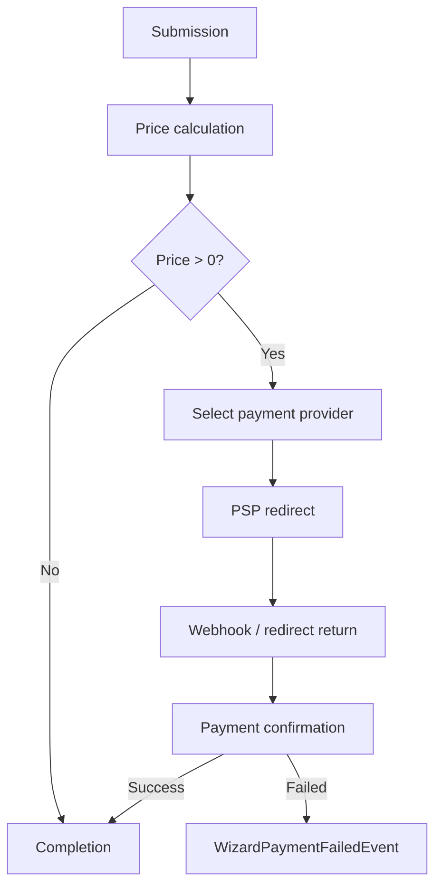
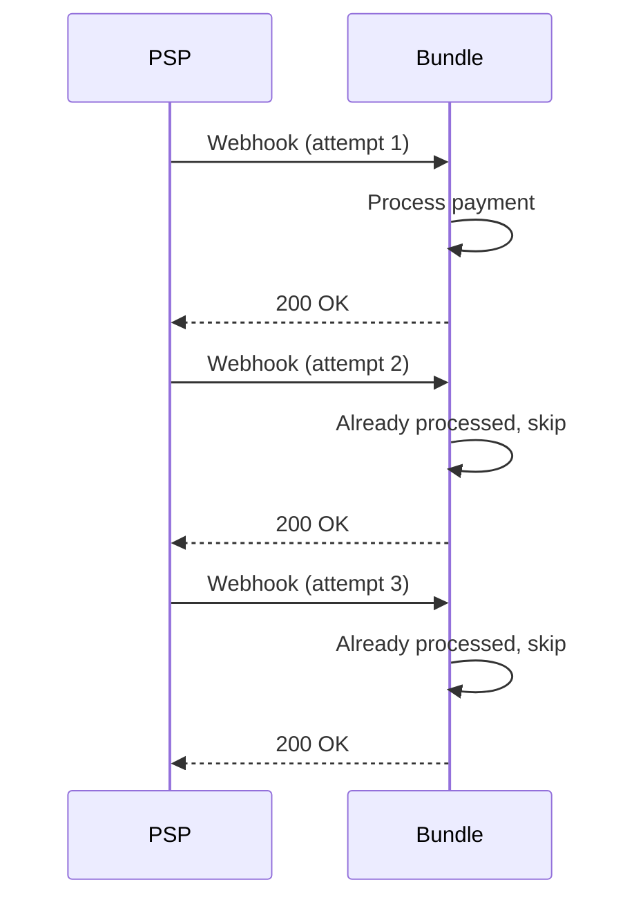

# Payment Lifecycle

Payments are optional in the wizard system and only occur when the calculated price of a submission is greater than zero.

---

## Overview



---

## Step 1 — Submission

The user completes wizard steps.

During submission the system calculates a **total price** based on the configured wizard fields.

Prices can be defined at multiple levels:

| Level | Description |
|-------|-------------|
| Form level | A fixed price applied to the entire submission |
| Field level | A price attached to a specific field value |
| Nested field structures | Prices within repeatable groups or conditional fields |

---

## Step 2 — Payment Initiation

If the calculated price is greater than zero:

1. A payment provider is selected
2. A transaction is created
3. The user is redirected to the PSP

**Example providers:**
- Mollie
- Stripe
- Custom implementations via `#[AsPaymentProvider]`

---

## Step 3 — PSP Interaction

The user completes the payment on the provider platform.

The bundle supports the following response mechanisms:

| Mechanism | Description |
|-----------|-------------|
| Redirect return | User is sent back to the wizard after payment |
| Webhook | PSP sends a server-side notification |
| Both | Most providers use a combination of both |

---

## Step 4 — Payment Confirmation

The system verifies the payment using the configured provider.

```
Provider::fetchStatus(transactionId) → PaymentStatus
```

The provider returns a `PaymentStatus` which determines the next step in the lifecycle.

---

## Step 5 — Completion

After a successful payment:

- The submission is marked **completed**
- Completion events are dispatched
- Notifications may be sent
- Exports become available

---

## Idempotency

Payment processing must be **idempotent**.

> Multiple retries — whether from webhooks or redirects — must never cause duplicate side effects.



This means the system guarantees:

| Scenario | Guarantee |
|----------|-----------|
| Duplicate webhook calls | Only processed once |
| User returning via redirect multiple times | No duplicate submissions |
| Retry after failure | No duplicate notifications |
